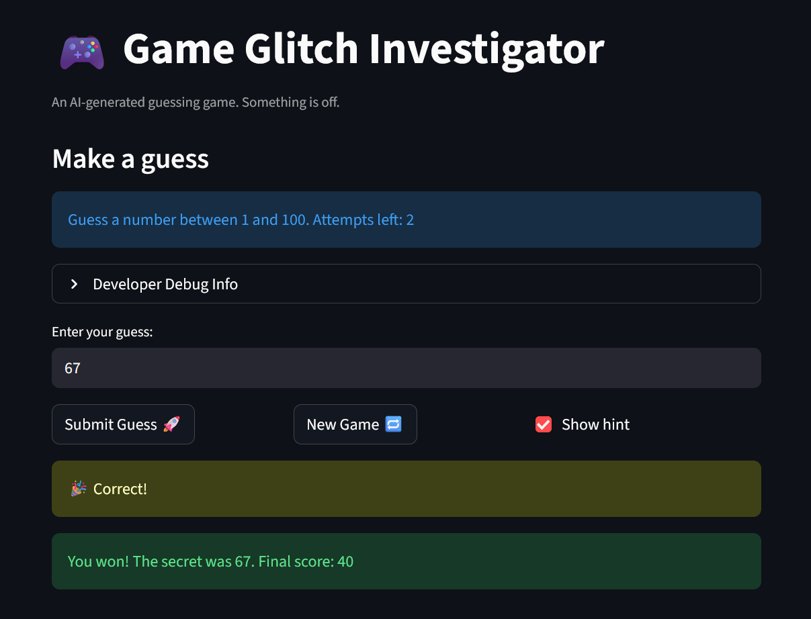

# 🎮 Game Glitch Investigator: The Impossible Guesser

## 🚨 The Situation

You asked an AI to build a simple "Number Guessing Game" using Streamlit.
It wrote the code, ran away, and now the game is unplayable. 

- You can't win.
- The hints lie to you.
- The secret number seems to have commitment issues.

## 🛠️ Setup

1. Install dependencies: `pip install -r requirements.txt`
2. Run the broken app: `python -m streamlit run app.py`

## 🕵️‍♂️ Your Mission

1. **Play the game.** Open the "Developer Debug Info" tab in the app to see the secret number. Try to win.
2. **Find the State Bug.** Why does the secret number change every time you click "Submit"? Ask ChatGPT: *"How do I keep a variable from resetting in Streamlit when I click a button?"*
3. **Fix the Logic.** The hints ("Higher/Lower") are wrong. Fix them.
4. **Refactor & Test.** - Move the logic into `logic_utils.py`.
   - Run `pytest` in your terminal.
   - Keep fixing until all tests pass!

## 📝 Document Your Experience

- [ ] Describe the game's purpose.
The purpose of the game is to guess a randomly generated number with a given amount of attempts. There are multiple difficulty modes which correspond to the amount of starting attempts you are given. When an attempt is made, you are given a comparison of your attempt to the actual value (less than, greater than, or equal to), pushing you to the correct answer!
- [ ] Detail which bugs you found.
There were multiple bugs that halted the proper operation of the game. The first major bug was the flipped hint logic, which would incorrectly guide the user to the wrong number by telling them the opposite comparison of their attempt to the actual secret number. Another bug was that attempts were off-by-one, where the game would terminate early despite the user having one more attempt.
- [ ] Explain what fixes you applied.
The major game logic was ported into another file with deliberate functions to represent major functionality in the game, making modifications and updates easier long-term. The specific fixes including re-flipping the hint logic and changing the attempt session state variable to fix the respective issues.

## 📸 Demo

- [ ] [Insert a screenshot of your fixed, winning game here]

## 🚀 Stretch Features

- [ ] [If you choose to complete Challenge 4, insert a screenshot of your Enhanced Game UI here]
